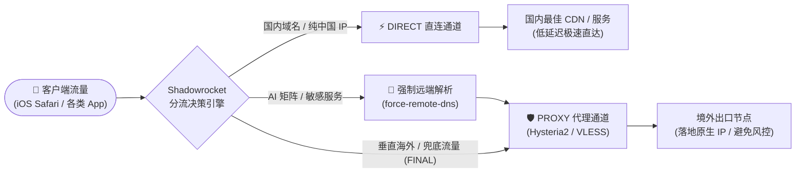
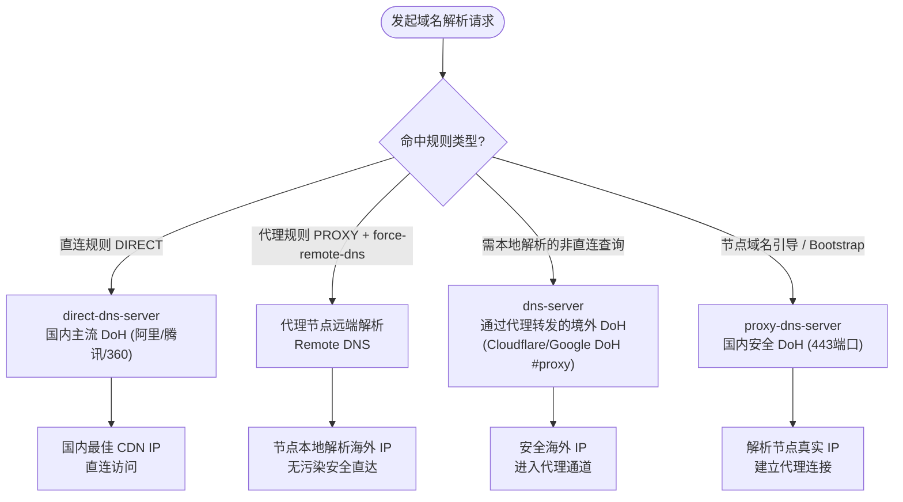
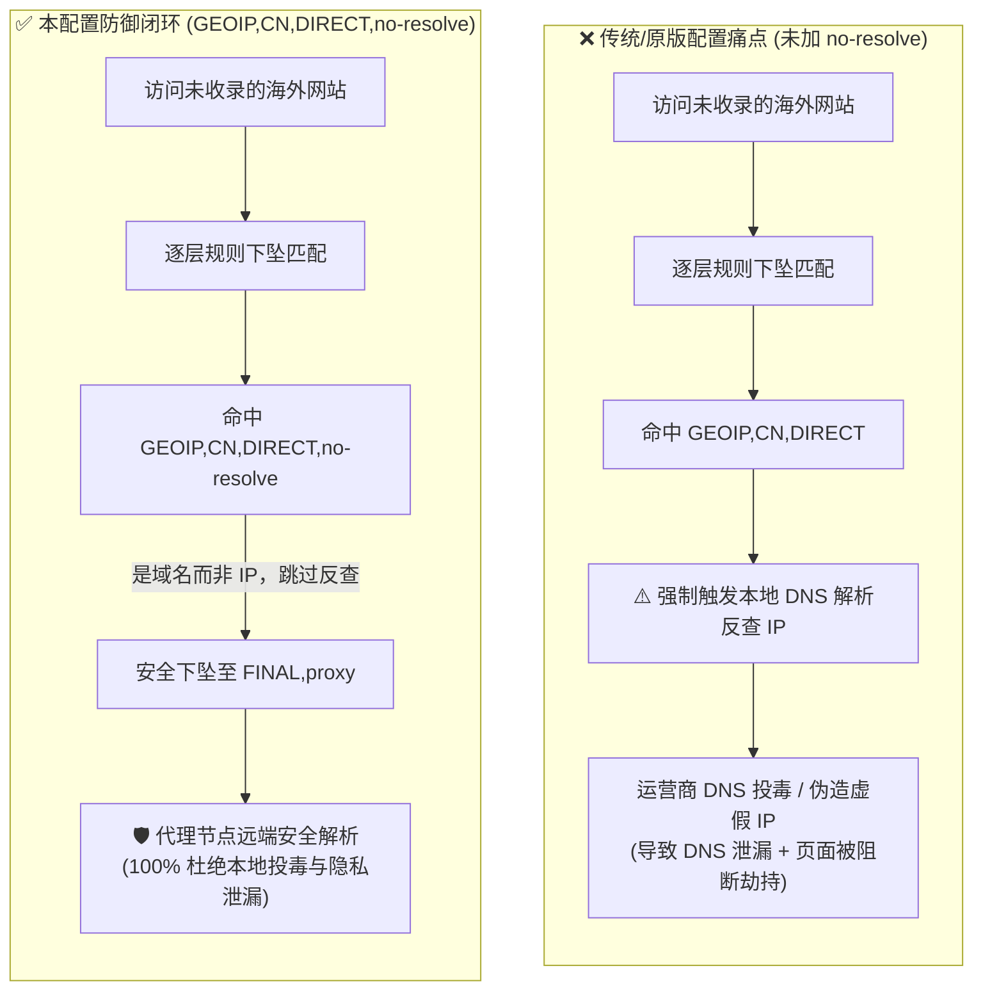
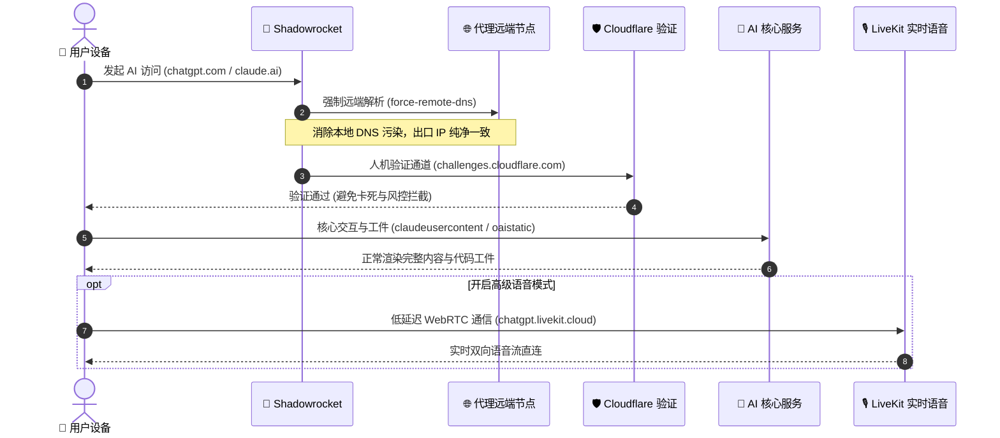
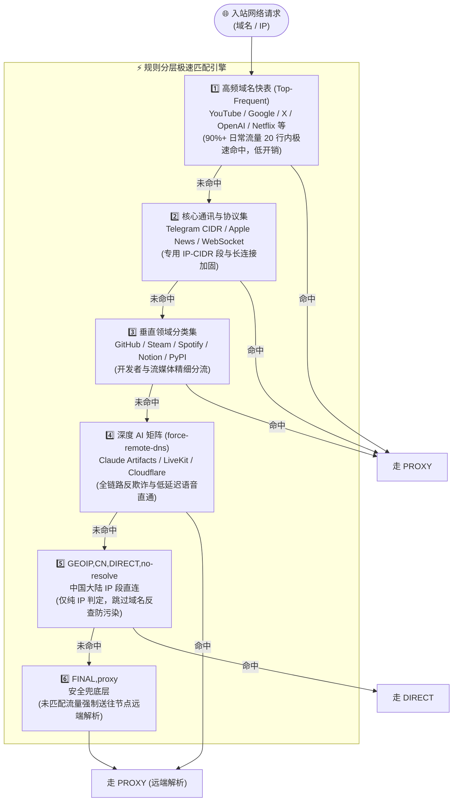

# Shadowrocket 精准分流与防污染强固规则配置 (`fg_cnip_splitdns.conf`)

> **基于 [Johnshall/Shadowrocket-ADBlock-Rules-Forever](https://github.com/Johnshall/Shadowrocket-ADBlock-Rules-Forever) 深度定制与强化**  
> 专为 **Hysteria2 / VLESS-Reality** 等现代代理协议打造，深度优化 **Split-DNS 分流、抗 DNS 污染、现代 AI 生态链路全覆盖与极速访问体验**。

---

## 📖 目录

- [🌟 核心特性与设计哲学](#-核心特性与设计哲学)
- [🧩 DNS 分流架构详解 (Split-DNS)](#-dns-分流架构详解-split-dns)
- [🛡️ 防污染与抗封锁强化 (Anti-Censorship Hardening)](#️-防污染与抗封锁强化-anti-censorship-hardening)
- [🤖 现代 AI 全生态加固 (Force-Remote-DNS)](#-现代-ai-全生态加固-force-remote-dns)
- [⚡ 规则分层与匹配优先级](#-规则分层与匹配优先级)
- [🚀 导入与使用教程](#-导入与使用教程)
- [🔍 验证与排错指南 (FAQ)](#-验证与排错指南-faq)
- [📝 版本更新日志](#-版本更新日志)

---

## 🌟 核心特性与设计哲学

1. **国内外精准分流**：
   - **国内流量**：直连（`DIRECT`），通过国内主流安全 DoH 解析，精准命中最近 CDN 节点，淘宝、微信、网易云等国内服务极速直达。
   - **国外流量**：代理（`PROXY`），规则末尾安全保底（`FINAL,proxy`），未命中的海外站点全部走代理。
2. **零污染与零泄漏的 Split-DNS**：
   - 国内直连流量使用国内 DoH，境外代理流量强制通过节点远端解析（`force-remote-dns`）或节点转发的境外 DoH，彻底杜绝本地运营商的 DNS 投毒与污染。
3. **专为 Hysteria2 / QUIC 高速协议调优**：
   - 静态固化 DoH 端点 IP，消除递归解析带来的延迟与阻塞。
   - 针对 UDP 抖动配备自动降级与本地安全回退，保证网络切换时不出现长时间无响应。
4. **AI 与长连接通讯全链路打通**：
   - 覆盖 OpenAI / Claude / Gemini / Grok 等主流 AI 的核心 API、WebSocket、语音实时传输（WebRTC/LiveKit）、人机验证（Cloudflare Turnstile）及遥测开关，避免风控阻断。
   - 深度支持 Discord、Telegram、WhatsApp、Spotify 等长连接与富媒体服务。
5. **无侵入纯净分流**：
   - **不包含广告过滤**，避免误杀正常网页组件与引发 App 闪退，纯粹聚焦于网络连接的稳定、高速与安全。

### 🌐 全局分流与路由决策架构



---

## 🧩 DNS 分流架构详解 (Split-DNS)

Shadowrocket 底层机制中，`dns-server` 与 `direct-dns-server` 仅用于处理**需要在本地解析**的请求。如果配置不当，可能导致海外域名先向国内 DNS 请求，从而遭遇 GFW 污染与 IP 漂移。

本配置构建了四层清晰、互不干扰的 DNS 管道：



### 参数配置说明

| 参数项 | 取值 | 作用说明 |
| :--- | :--- | :--- |
| `direct-dns-server` | `https://dns.alidns.com/dns-query`, `https://doh.pub/dns-query`, `https://doh.360.cn/dns-query` | 直连网站解析。全走 443 端口加密 DoH，防止运营商劫持，确保国内 CDN 定位精准。 |
| `dns-server` | `https://cloudflare-dns.com/...#proxy`, `https://dns.google/...#proxy` | 带有 `#proxy` 标签，非直连且需在本地解析的请求走代理链路转发给海外 DoH，彻底避免污染。 |
| `fallback-dns-server` | `https://dns.alidns.com/dns-query` | Hysteria2 优化项；当节点抖动或代理通道未就绪时，回退到国内 DoH，保证基础网络不中断。 |
| `proxy-dns-server` | `https://dns.alidns.com/dns-query`, `https://doh.pub/dns-query` | **节点域名引导 DNS**。摒弃易被运营商 QoS 限速的 853 端口 DoT，全面使用 443 端口 DoH，伪装成普通 HTTPS 流量解析节点域名。 |
| `[Host]` 静态映射 | `dns.alidns.com = 223.5.5.5`, `cloudflare-dns.com = 1.1.1.1` 等 | **静态端点硬编码**，消除“为了连 DoH 而必须先解析 DoH 域名”的鸡生蛋递归循环，节约 1 次 RTT 握手时延。 |

---

## 🛡️ 防污染与抗封锁强化 (Anti-Censorship Hardening)

针对复杂的网络嗅探与丢包环境，配置文件开启了多项系统级强化指令：

1. **`GEOIP,CN,DIRECT,no-resolve`（关键修正）**
   - **原版痛点**：若未加 `no-resolve`，所有未命中前面域名的流量，在判定是否为中国 IP 时会**强制触发本地 DNS 解析**。如果此时域名属于未收录的海外网站，将被直接送给运营商解析并立刻遭遇污染伪造 IP。
   - **补丁效果**：`no-resolve` 使得仅有纯 IP 请求或已在前面步骤解析过的请求才参与 GEOIP 判定；未匹配到的域名直接流入 `FINAL,proxy` 并在节点远端解析，实现 100% 防投毒。



2. **`private-ip-answer = true`**
   - 丢弃上游 DNS 返回的私有地址（如 `127.0.0.1`、`0.0.0.0`、`192.168.x.x`）。有效拦截 DNS 重绑定攻击与恶意污染回包。
3. **`fast-open = true`**
   - 开启 TCP Fast Open (TFO)，允许在 TCP 三次握手 SYN 包中携带第一波应用层数据，减少一次 RTT，对高频突发请求提升明显。
4. **`icmp-auto-reply = true`**
   - 由 Shadowrocket 本地自动回复 ICMP Ping 探测包，避免部分 iOS 应用因探测网络超时而出现等待卡顿。
5. **`ipv6 = true` & `prefer-ipv6 = false`**
   - 开启 IPv6 解析能力，但在双栈（IPv4 / IPv6）环境下优先使用稳定成熟的 IPv4，兼顾连通性与低丢包率。

---

## 🤖 现代 AI 全生态加固 (Force-Remote-DNS)

现代生成式 AI 服务（OpenAI / Claude / Gemini / xAI）对环境检测极其严格，若 DNS 结果与代理节点出口不对齐，极易触发**403 Forbidden、Cloudflare 验证循环、IP 欺诈风控甚至封号**。

本配置对 AI 服务实施了**全链条远端解析强制化（`force-remote-dns`）**与**周边生态精细覆盖**：



### 1. OpenAI / ChatGPT / Sora
- **主站与认证**：`openai.com`, `chatgpt.com`, `chat.com`, `auth0.openai.com`
- **生成视频与资产**：`sora.com`, `oaistatic.com`, `oaiusercontent.com`
- **语音实时模式（LiveKit WebRTC）**：`chatgpt.livekit.cloud`（确保 ChatGPT Advanced Voice 实时语音通话低延迟直连节点）
- **功能开关与遥测**：`statsig.com`, `statsigapi.net`, `featuregates.org`（防止功能开关加载失败导致模型列表空白）
- **人机验证防护**：`challenges.cloudflare.com` 精准代理，避免人机验证卡死

### 2. Claude / Anthropic
- **核心主站**：`anthropic.com`, `claude.ai`, `claude.com`, `clau.de`
- **用户内容与工件**：`claudeusercontent.com`（保障 Artifacts 正常渲染与下载）
- **开发者控制台与 API**：`api.anthropic.com`, `platform.claude.com`
- **遥测上报**：`browser-intake-us5-datadoghq.com`（防止因前端遥测被阻断而触发反欺诈风控）

### 3. Google Gemini / AI Studio
- **AI 门户**：`gemini.google.com`, `aistudio.google.com`, `bard.google.com`, `notebooklm.google`
- **开发与 API**：`generativelanguage.googleapis.com`, `ai.google.dev`, `deepmind.google`
- **开发工具后端**：`cloudcode-pa.googleapis.com`, `geller-pa.googleapis.com`（确保 Gemini CLI / Antigravity / Cloud Code 等插件畅行）

### 4. xAI Grok
- **全家桶覆盖**：`x.ai`, `grok.com`, `api.x.ai`, `console.x.ai`, `grokusercontent.com`

---

## ⚡ 规则分层与匹配优先级

为了兼顾**性能**与**精准度**，规则按照执行顺序分为 6 个层级：



---

## 🚀 导入与使用教程

### 方式一：本地文件直接导入（推荐）
1. 在 iOS 设备上打开 **Shadowrocket（小火箭）**。
2. 进入底部导航栏的 **「配置」 (Configuration)** 页面。
3. 点击右上角的 **`+`** 号。
4. 选择 **「从文件导入」**，选中本项目中的 [fg_cnip_splitdns.conf](file:///Users/suxa/Fg-Code/%E5%BF%AB%E6%8D%B7%E6%8C%87%E4%BB%A4/shadowrocket/fg_cnip_splitdns.conf)。
5. 导入成功后，在配置文件列表中**勾选**此配置使其生效（图标右侧亮起小圆点）。

### 方式二：远程 URL 托管订阅
1. 将 `fg_cnip_splitdns.conf` 上传至您的私有 GitHub / Gist / 服务器。
2. 在 Shadowrocket 的 **「配置」** 页面点击 **`+`**，在 URL 处粘贴链接后点击 **下载**。
3. 勾选使用，并可定期长按配置选择 **「从 URL 更新」**。

### 客户端运行模式建议
- **全局路由模式**：确保选择 **「配置」 (Config)** 模式（非 Proxy 或 Direct）。
- **HTTPS 解密 (MITM)**：若需要 `google.cn -> google.com` 的 302 重定向功能，可在「配置」->「证书」中生成并安装信任根证书，开启 MITM 开关；如不需要可保持关闭。

---

## 🔍 验证与排错指南 (FAQ)

### Q1: 如何验证 DNS 分流和防污染是否生效？
- **国内验证**：在 Safari 中访问 `https://cip.cc` 或 `https://ip.skk.moe`，应显示您本地运营商的真实公网 IP。
- **国外验证**：访问 `https://browserleaks.com/dns`，查看 DNS 泄漏测试。DNS 结果应为代理节点所在地的 DNS（如 Cloudflare / Google），而不应出现任何国内运营商（电信/联通/移动）的 DNS。

### Q2: 为什么使用 Hysteria2 节点切换时不会断网？
- 本配置配备了 `dns.alidns.com` 等静态 IP 引导 (`[Host]`)，并且在 `fallback-dns-server` 中保留了本地可用通道，即便节点在握手重连，基础 DNS 解析依然不会因死锁而瘫痪。

### Q3: 为什么 ChatGPT 语音或实时功能一直连不上？
- 请检查是否使用了支持 UDP 转发的节点（如 Hysteria2 / Shadowsocks 等协议），因为语音通话（WebRTC）严重依赖 UDP 通道。本规则已包含 `chatgpt.livekit.cloud` 及其全部配套域名的 `force-remote-dns`。

### Q4: 某些国内银行或冷门政企网站打不开？
- 极少数冷门国内网站其 IP 未被收录进 MaxMind 的 GeoIP 数据库中。
- **解决方法**：在规则文件 `[Rule]` 顶部的直连区添加一行：
  ```ini
  DOMAIN-SUFFIX,your-bank-domain.com,DIRECT
  ```

---

## 📝 版本更新日志

- **2026-09-27**
  - **Anti-Censorship 强化**：全面开启 `private-ip-answer`（防污染回包）、`fast-open`（降低 RTT）、`icmp-auto-reply`。
  - **DNS 协议升级**：淘汰易受阻断的 853 端口 DoT 引导，全面转为 443 端口 DoH。
  - **Hysteria2 弹性调优**：引入 `fallback-dns-server` 与静态 `[Host]` IP 映射池，杜绝 DNS 递归解析死锁。
  - **AI 矩阵与通讯强化**：补齐 Claude Artifacts/Datadog、OpenAI LiveKit 实时语音、Grok、Discord WebSocket 等 `force-remote-dns` 规则。
- **2026-09-24**
  - **Split-DNS 落地**：重构 `direct-dns-server` 与 `dns-server` 分流架构。
  - **GEOIP 漏洞修复**：`GEOIP,CN,DIRECT` 增加 `no-resolve` 标签，阻止海外域名向国内 DNS 泄露与受投毒。
  - **前置高频区**：引入 20+ 顶级高频外网域名优先匹配层，大幅降低 CPU 开销。
- **Upstream Baseline**
  - 基于 [Johnshall/Shadowrocket-ADBlock-Rules-Forever](https://github.com/Johnshall/Shadowrocket-ADBlock-Rules-Forever) 核心分流精简版。
